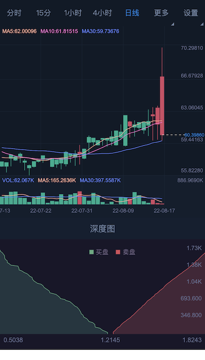
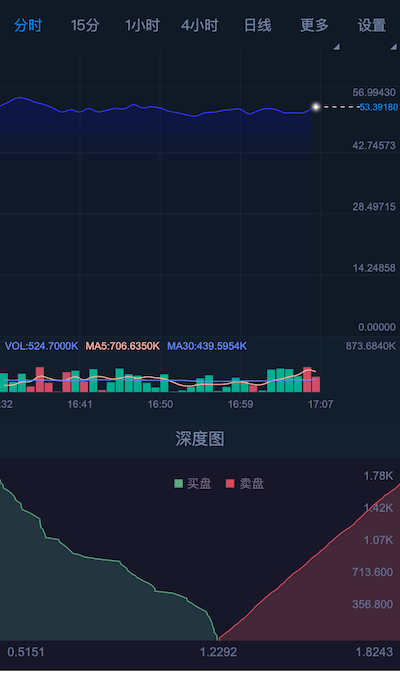

## Build
```angular2html
# 安装依赖
npm install

# 调试
npm run dev

开发使用脚本/src/libs/chart.min.js，Vue、React框架后续提供
```
# 使用说明

## 1、k线图
* ChartGraph 为class对象，使用时使用new创建对象，参数如下

参数名称 | 必须 | 参数说明
---- | ---- | ----
el | 是 | 绘制的目标节点，绘制内容为el对于大小
url | 是 | 获取k线图数据的GET接口，需自己实现
request | 是 | 获取k线图接口参数
updateInterval | 否 | 刷新间隔，默认30000、 0不刷新

***服务器接口request参数如下***

参数名称 | 必须 | 参数说明
---- | ---- | ----
channel | 是 | 绘制通道，可以是某个股票或者区块链币对
period | 是 | 需要绘制的k线图数据统计时间（单位分钟），如1、5、15、30、60、240、1440
limit | 是 | k线图展示的数量
time | 否 | k线图实时刷新传入的最新时间，如果传入返回time后最新数据，否则返回旧数据，初始时不需要传入

***接口返回参数***

参数名称 | 必须 | 参数说明
---- | ---- | ----
code | 是 | 0成功、其他失败
data | 是 | k线图数据格式（[参考接口](https://test.ranjun.work/api/k?channel=TEST&period=1440&limit=1500)), <br>[[时间秒,开盘价,最高价,最低价,收盘价,数量]]
* ChartGraph 对象接口说明
  
接口名称 | 接口说明 | 参数说明
---- | ---- | ----
update | 刷新图表 | request参数
updateChangeMa | 显示MA | true显示，false不显示
showTime | 显示分时图 | 无参数
stopUpdate | 停止刷新 | 无参数
startUpdate | 开始刷新 | 无参数
destroy | 删除 | 无参数

## 2、深度图

* DepthChart 为class对象，使用时使用new创建对象，参数如下

参数名称 | 必须 | 参数说明
---- | ---- | ----
el | 是 | 绘制的目标节点，绘制内容为el对于大小
url | 是 | 获取k线图数据的GET接口，需自己实现
request | 是 | 获取k线图接口参数
updateInterval | 否 | 刷新间隔，默认30000、 0不刷新

***服务器接口request参数如下***

参数名称 | 必须 | 参数说明
---- | ---- | ----
channel | 是 | 绘制通道，可以是某个股票或者区块链币对
limit | 是 | 展示左右的数量

参数名称 | 必须 | 参数说明
---- | ---- | ----
code | 是 | 0成功、其他失败
data | 是 | 数据格式（[参考接口](https://test.ranjun.work/api/depth?channel=TEST&limit=60)), <br>{<br>&nbsp;&nbsp;&nbsp;asks:[{<br>&nbsp;&nbsp;&nbsp;&nbsp;&nbsp;&nbsp;&nbsp;&nbsp;price:number,<br>&nbsp;&nbsp;&nbsp;&nbsp;&nbsp;&nbsp;&nbsp;&nbsp;total:number,<br>&nbsp;&nbsp;&nbsp;&nbsp;&nbsp;&nbsp;&nbsp;&nbsp;volume:number<br>&nbsp;&nbsp;&nbsp;&nbsp;}],<br>&nbsp;&nbsp;&nbsp;&nbsp;bids:[{<br>&nbsp;&nbsp;&nbsp;&nbsp;&nbsp;&nbsp;&nbsp;&nbsp;price:number,<br>&nbsp;&nbsp;&nbsp;&nbsp;&nbsp;&nbsp;&nbsp;&nbsp;total:number,<br>&nbsp;&nbsp;&nbsp;&nbsp;&nbsp;&nbsp;&nbsp;&nbsp;volume:number<br>&nbsp;&nbsp;&nbsp;&nbsp;&nbsp;}]<br>}<br>asks安装price升序排列，bids为降序

* DepthChart 对象接口说明

接口名称 | 接口说明 | 参数说明
---- | ---- | ----
update | 刷新图表 | channel
stopUpdate | 停止刷新 | 无参数
startUpdate | 开始刷新 | 无参数
destroy | 删除 | 无参数

## 3、实例

```angular2html
1)、k线图
const kLineChart = new ChartGraph({
    el: window.document.getElementById('chart'),
    url: 'http://https://test.ranjun.work/api/k',
    request: {
        channel: 'TEST',
        period: 1440,           //分钟, 日线图
        limit: 1500,            //初始获取1500条数据
        //其他参数
    },
});
//显示分时图
kLineChart.showTime()
//隐藏MA
kLineChart.updateChangeMa(false)
//更新图
kLineChart.update({
    request: {
        period: 15          //更新为15分钟
    }
})
2)、深度图
let depthChart = new DepthChart({
    request: {
        channel: 'USDT',
        limit: 60
    },
    el: document.getElementById('depth'),
    url: serverUrl+'/api/depth',
})
```
